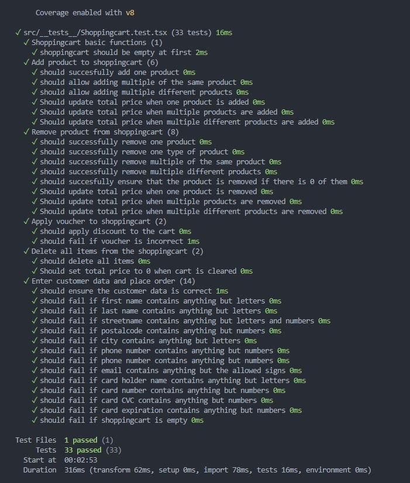
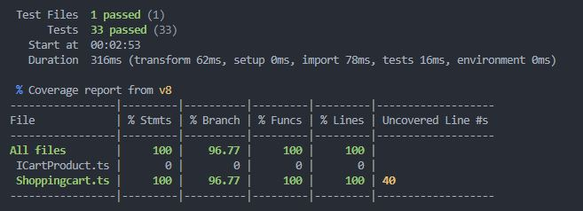

# Testing, inlämning 1

## Code Coverage

## Included Tests

I have implemented tests for:
### Basic function, shoppingcart
- Shoppingcart should be empty at first

### Add product to shoppingcart
- succesfully add one product
- allow adding multiple of the same product
- allow adding multiple different products
- update total price when one product is added
- update total price when multiple products are added
- update total price when multiple different products are added

### Remove product from shoppingcart
- successfully remove one product
- successfully remove one type of product
- successfully remove multiple of the same product
- successfully remove multiple different products
- succesfully ensure that the product is removed if there is 0 of them
- update total price when one product is removed
- update total price when multiple products are removed
- update total price when multiple different products are removed

### Apply voucher to shoppingcart
- apply discount to the cart
- fail if voucher is incorrect

### Delete all items from the shoppingcart
- delete all items
- set total price to 0 when cart is cleared

### Enter customer data and place order
- ensure the customer data is correct
- fail if first name contains anything but letters
- fail if last name contains anything but letters
- fail if streetname contains anything but letters and numbers
- fail if postalcode contains anything but numbers
- fail if city contains anything but letters
- fail if phone number contains anything but numbers
- fail if phone number contains anything but numbers
- fail if email contains anything but the allowed signs
- fail if card holder name contains anything but letters
- fail if card number contains anything but numbers
- fail if card CVC contains anything but numbers
- fail if card expiration contains anything but numbers
- fail if shoppingcart is empty

----------------------------------------------------

**Important!** This project contains way more files and functionality (as well as terrible humor) than what was required for the assignment.
The only relevant files for the actual tests are:

### Folder: models
- ICartProduct.ts
- ICustomerData.ts
- Shoppingcart.ts
### Folder: __ tests __
- Shoppingcart.test.tsx

Aside from that I assume the .github folder as well as package.json would be relevant.